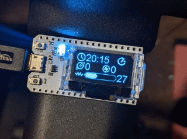

# ECHBT

This is a Bluetooth client for the Echelon Sport stationary bike. (May work with others)

It's written using Arduino and designed for this board: https://www.makerfocus.com/collections/esp32 (MakerFocus ESP32)

Amazon: https://www.amazon.com/gp/product/B076KJZ5QM

It scans and connects on startup for an Echelon Sport bike and connects automatically

It shows:
* Cadence
* Resistance
* Calculated Power

The resistance and power is roughly adjusted to be compatible with Peleton.

LICENSE:  This work is licensed under a <a rel="license" href="http://creativecommons.org/licenses/by-nc-sa/4.0/">Creative Commons Attribution-NonCommercial-ShareAlike 4.0 International License</a>.

